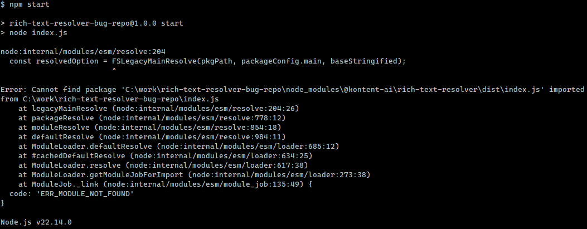

Repro for

1. `git@github.com:simonhudson/rich-text-resolver-bug-repo.git`
2. `npm install`
3. `npm start`

**Expected**

`console.log` should output parsed rich text

**Actual**

```
Error: Cannot find package 'C:\work\rich-text-resolver-bug-repo\node_modules\@kontent-ai\rich-text-resolver\dist\index.js' imported from C:\work\rich-text-resolver-bug-repo\index.js
```


